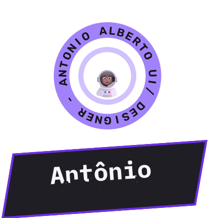
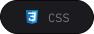
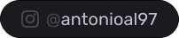
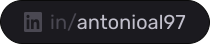
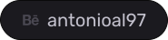

# 😎 Antônio Alberto!

### Olá pessoas,

- 🥷 `Formado` em Análise e Desenvolvimetno de Sistemas,
- 👶 Dev. `Frontedn Jr`. e melhorando,

Obrigado por virem! Viram meus repositórios ? Não? Da uma olhada lá e se tiver alguma sugestão, deixa seu PR!  

  
  
  
  

## 🪄 &nbsp;Ferramentas de criação

&nbsp;
&nbsp;
&nbsp;
&nbsp;
&nbsp;
&nbsp;
&nbsp;
&nbsp;
&nbsp;
&nbsp;
&nbsp;
&nbsp;
&nbsp;

> As techs que mais utilizo em meu dia a dia são **React, HTML, CSS, Wordpress**!

Quer começar um projeto com uma essas techs? Me manda uma DM que a gente conversa!
## 🔥 Social Links

