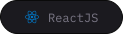
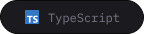
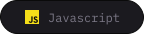
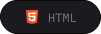
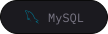
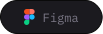
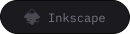

# 😎 Antônio Alberto!

### Olá pessoas, sou

- 🥷 `Formado` em Análise e Desenvolvimetno de Sistemas,
- 👶 Dev. `Frontedn Jr`. e melhorando,

**Obrigado por virem**! Vejam meus repositórios e se tiver alguma sugestão deixe seu PR!  

  
  
  
  

## 🪄 &nbsp;Ferramentas de criação

&nbsp;
&nbsp;
&nbsp;
&nbsp;
&nbsp;
&nbsp;
&nbsp;
&nbsp;
&nbsp;
&nbsp;
&nbsp;
&nbsp;
&nbsp;

> As techs que mais utilizo em meu dia a dia são **React, HTML, CSS, Wordpress**!

Quer começar um novo projeto com alguma dessas techs? Me manda uma [DM](https://instagram.com/antonioal97) que a gente conversa!

  

## 🔥 Social Links

Deem uma olhada em alguns dos projetos de design que publico no meu [Behance](https://www.behance.net/antonioal97) e no meu [Linkedin](https://www.linkedin.com/in/antonioal97/).

